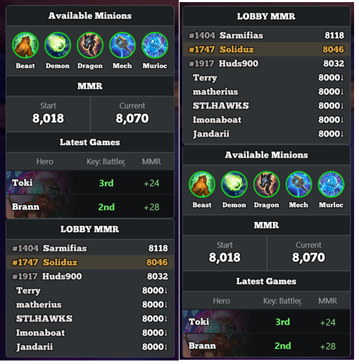
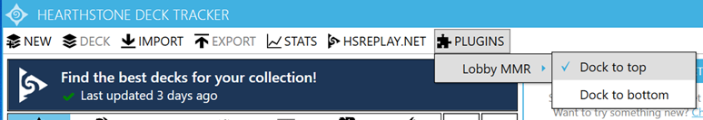

# HDT Lobby MMR

A small add-on for [Hearthstone Deck Tracker](https://github.com/HearthSim/Hearthstone-Deck-Tracker)
that shows the **rank (MMR) of every player in your Battlegrounds lobby**. It sits
right next to the Battlegrounds session box and is made to look like part of the
tracker.



## What it does

- Lists everyone in your lobby with their MMR, highest at the top.
- Highlights **you** in gold.
- Players ranked above 8000 show their exact number. Everyone else shows `8000↓`.
- You can put the list at the **top** or the **bottom** of the session box (see below).

Heads up: player names only appear **after you move your mouse over the leaderboard**
in the game.

## Install

1. Download `HDT_LobbyMMR-v1.1.0.zip` from the
   [Releases page](https://github.com/zakarulcodes/HDT_LobbyMMR/releases).
2. Close Hearthstone Deck Tracker.
3. Unzip it and put `HDT_LobbyMMR.dll` into this folder (create it if it isn't there):
   ```
   %AppData%\HearthstoneDeckTracker\Plugins\
   ```
4. Open Hearthstone Deck Tracker again, go to **Options → Tracker → Plugins**, and
   turn on **Lobby MMR**.

## Putting the list at the top or bottom

You can choose where the list sits, and it remembers your choice:

- Open the **Plugins → Lobby MMR** menu and pick **Dock to top** or **Dock to bottom**, **or**
- In **Options → Tracker → Plugins**, select the plugin and click the
  **Toggle dock: top / bottom** button.



## Credit

The MMR data and the method for reading player names come from **IBM5100's**
[HDT_BGrank](https://github.com/IBM5100o/HDT_BGrank).
