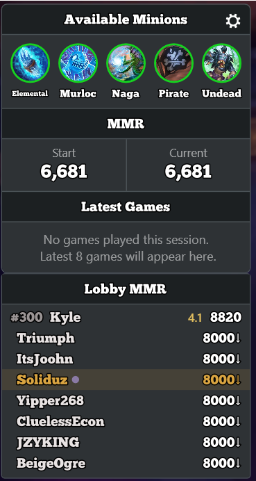
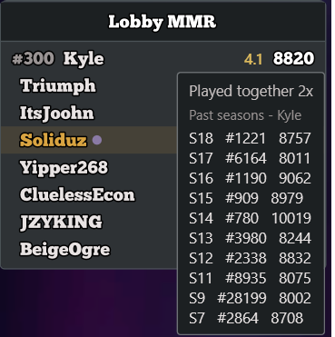
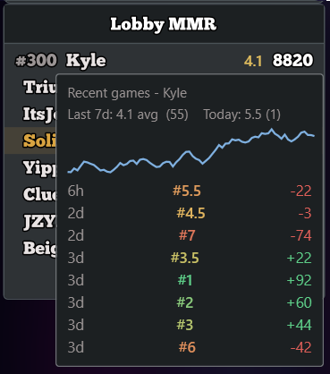
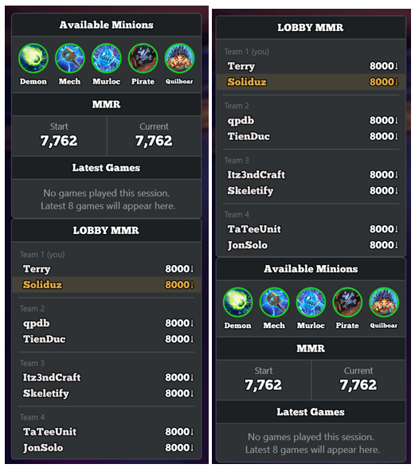
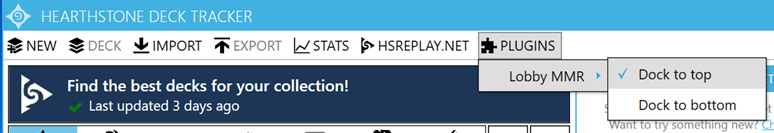

# LobbyLens

A small add-on for [Hearthstone Deck Tracker](https://github.com/HearthSim/Hearthstone-Deck-Tracker)
that shows the **rank (MMR) of every player in your Battlegrounds lobby**. It sits
right next to the Battlegrounds session box and is made to look like part of the
tracker.



## What it does

- Lists everyone in your lobby with their MMR and leaderboard rank (e.g. `#1404`), highest at the top.
- Highlights **you** in gold.
- Players ranked above 8000 show their exact number and rank. Everyone else shows `8000↓` with no rank.
- In **duo** lobbies, players are grouped by team, with the strongest team on top and the
  higher-MMR teammate listed first in each team.
- Shows a small dot next to the name of any player who's a **known streamer**: bright red when
  they're **live** right now, muted purple when offline.
- Shows a colored **recent-form chip** (average finish over recent games, from
  [wallii.gg](https://www.wallii.gg/)) next to tracked players, green for strong through red for weak.
- **Hover a player** to see, in a box beside their row, how many times you've been in a lobby
  with them, their **average MMR** across every ranked season in both modes (a quick read on how
  good they are, even if their current lobby MMR is below the cutoff), plus their **past-season
  ranks**: rank and MMR for each season they finished at 8000+, newest first. Solo lobbies show
  solo history (seasons 6-18); duo lobbies show duo history (seasons 12-18). Players with no
  matching history show `No history`.
- **Click a player** with a recent-form chip to open a dossier: their recent games with
  per-game placements and rating change, plus an MMR trajectory sparkline, for the current
  mode (solo or duo).
- **Greys out players as they're eliminated** and drops them below the survivors, most-recently
  knocked out first. In duo lobbies a team's header greys out once both teammates are gone.
- You can put the list at the **top** or the **bottom** of the session box (see below).







Heads up: player names only appear **after you move your mouse over the leaderboard**
in the game.

## Install

1. Download the latest `HDT_LobbyMMR-vX.Y.Z.zip` from the
   [Releases page](https://github.com/zakarulcodes/HDT_LobbyMMR/releases).
2. Close Hearthstone Deck Tracker.
3. Unzip it and put `HDT_LobbyMMR.dll` into this folder (create it if it isn't there):
   ```
   %AppData%\HearthstoneDeckTracker\Plugins\
   ```
4. Open Hearthstone Deck Tracker again, go to **Options → Tracker → Plugins**, and
   turn on **LobbyLens**.

## Putting the list at the top or bottom

You can choose where the list sits, and it remembers your choice:

- Open the **Plugins → LobbyLens** menu and pick **Dock to top** or **Dock to bottom**, **or**
- In **Options → Tracker → Plugins**, select the plugin and click the
  **Toggle dock: top / bottom** button.



## Known streamers

Players who are known Battlegrounds streamers get a small dot next to their name: bright red
when they're live right now, muted purple when offline. Live status and channels come from
[wallii.gg](https://www.wallii.gg/), with the community-submitted list as a fallback, both
updated automatically, so no plugin update is needed when someone new is added.

If you don't want to see it (or the rank column), open the **Plugins → LobbyLens** menu
and untick **Show streamer icon** or **Show rank position** — each is independent and
remembers your choice.

### Adding yourself to the streamer list

If you stream Battlegrounds, you can link your channel yourself — no GitHub account needed:

1. Go to [hdt-lobbymmr-submit.zakarulcodes.workers.dev](https://hdt-lobbymmr-submit.zakarulcodes.workers.dev/).
2. Click **Sign in with Twitch** to prove the channel is yours.
3. Enter your **exact in-game Battlegrounds name** (and optionally your YouTube channel), then submit.

Your marker goes live within a minute or two, no plugin update required. Names are
first-come, first-served and tied to the Twitch account that submitted them.

## Credit

The MMR data fallback and the method for reading player names come from the original plugin by **IBM5100's**
[HDT_BGrank](https://github.com/IBM5100o/HDT_BGrank).

Recent-form chips, the click dossier, and streamer live status use public data from
[wallii.gg](https://www.wallii.gg/).
